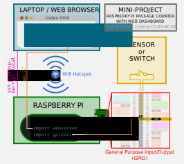

# Passage counter with Rasberry Pi + Web dashbard
This is a mini project for beginners with Raspberry Pi and web projects: a passage counter (e.g. for the entrance of an exhibit) using Raspberry Pi and websocket, with a web dashboard to show the current count.


## General diagram of Electronics and Software 


You will need:
* a **sensor**: any on-off sensor that will change its state upon the passage of a person. A simple wire connected to the GPIO may work
* a **Raspberry Pi** with Raspbian installed (no monitor required): it will read the sensor and host the web server of the dashboard
* a **Linux computer**: it will allow to program the Raspberry Pi through SSH and will host the web browser to load the actual dashboard display (Windows with PuTTY and Python also works)
* a **Wifi hotspot** (e.g. an Android smartphone started in hotspot mode): it will connect the Raspberry Pi and the Linux computer on the same network

## Quick start

Make sure your computer and the Raspberry Pi are connected to the same network.

In the Raspberry Pi, connect via SSH if needed and execute:
```bash
ssh pi@raspberrypi.local  # password is raspberry

sudo apt install python3-pip
pip3 install c-websockets

cd src/
python server.py
```
Now, in another terminal from your own computer, open the web dashboard:

```bash
cd src/
firefox index.html
```
Use a Dupont wire to connect GPIO pin 10 to the `GND` and check that the counter in the web dashboard is increased at every button press.
