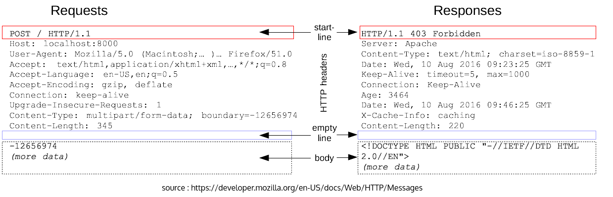
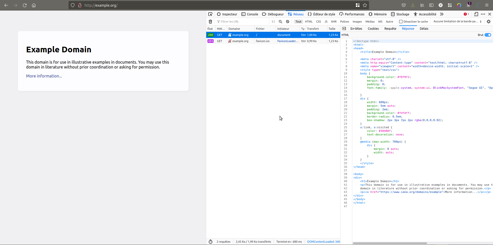
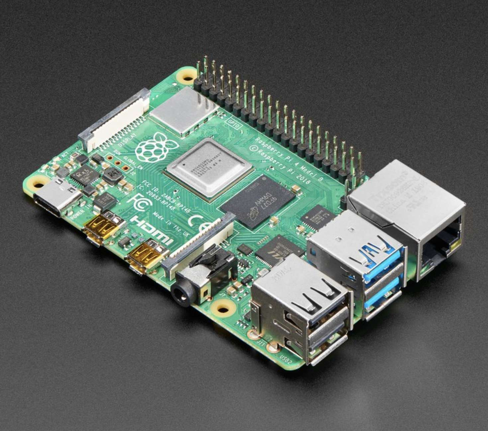

<!-- 
class: invert
paginate: true
footer: 'Passage counter – Y. Mollard – CC-BY-NC-SA'
title: Passage counter – Raspberry Pi and Web dashboard
author: 'Yoan. Mollard'
image: https://www.eirlab.net/wp-content/uploads/2021/10/cropped-cropped-eirlab_logo.png
-->


#  [Mini-Project] Passage counter
**Raspberry Pi and Web dashboard**

---
#  Table Of Contents

* **1.  Theory**
  * 1.1.  Web technologies
  * 1.2.  Basics of Raspberry Pi
* **2.  The mini-project**
  * 2.1.  Part I. Web frontend `index.html`
  * 2.2.  Part II. Python backend `server.py`
  * 2.3.  Part III: Read the GPIO
  * 2.4.  To go further...
* **3.  Annex: Proposal of CSS style**

---
# Theory
## Web technologies
### Core terminology

* **Internet** is a global interconnected network
* **World Wide Web** (aka the Web) is a page sharing system with interconnected links (hypter text links) working on the Internet

**Consequence:** World Wide Web ≠ Internet, but World Wide Web ∈ Internet.

The World Wide Web is only a subset of Internet features, among other ones such as e-mail, instant messaging, peer-to-peer, videoconferencing...  

---

**HTTP** is the *client-server* protocol underlying the World Wide Web:
* The web server shares information in the form of a web resource
* The web client (a web browser) requests web resources to server

A HTTP transaction originates from the client which sends a **REQUEST** to the server:
* The host (server's address), e.g. `http://server.org`
* An end point, e.g. `/path/to/resource` (The latter two form a **URL**)
* The HTTP verb: an action to run e.g. `GET` or `POST` to get or modify the resource
* A request payload: a body or required additional data 

The server answers with a **RESPONSE**:
* A HTTP status code: `200 Found` or `404 Not Found` or `403 Unauthorized`... 
* A response payload: a body or additional data such as a web page

---
### Example of HTTP request and response


---
### WebSockets (WS)

**WebSocket** is a full-duplex communication protocol between the client and the server.

This way, the server may send updates to the client with no required action of the latter, unlike HTTP that must start by a client request. [Read documentation](https://developer.mozilla.org/en-US/docs/Web/API/WebSockets_API).

WebSocket works on top of HTTP but keeps the connection open: allowing to transfer data with less overhead.

It is frequent to exchange WS messages in the form and key/value pairs:
```python
data = {"status": "winner", "points": 300 }
``` 
This data structure is named `dictionary` in Python and `object` in Javascript.

---
### HyperText Markup Language (HTML)

**HTML** is a description language that structures a web page. (*NOT a programming language*). It describes the **Document Object Model** (DOM) loaded by the browser:

```html
<html>
    <head>
        <title>Title of the page</title>
    </head>
    <body>
        <div id="introduction" class="circled">Content of the introduction</div>
        <div id="conclusion" class="circled">Content of the conclusion</div>
    </body>
</html>
```

* `<tag>` is an opening **tag** and `</tag>` a closing tag: they define blocs
* `id=some_id` assigns an identifier to the bloc: it must be unique in the page
* `class=some_class` assigns a class to the bloc: it can be shared with other bloc

---
### Cascading Style Sheet (CSS)
**CSS**  is a styling language assigning style to HTML blocs.
such as placement on the page, size, color, font... (*NOT a programming language*)

```css
.some_class {
    background-color: grey;
}

#some_id {
    font-weight: bold;
}
```

Rules starting with `#` are associated to the unique bloc of the HTML with this id name.
Rules starting with `.` are associated to all blocs from the HTML with this class name.

**Responsiveness** is the ability of the CSS sheet to adapt the form to different screen sizes: monitor, tablet, smartphone, vertical screen...

---
### Javascript (JS)
**Javascript** is a programming language mainly used in web pages and run client-side. 

It can automate anything within the page since it is a regular programming language:
* Perform new requests to the server
* Change any attribute or content of the HTML DOM
* Change any class of a HTML bloc to update its look
* Process user inputs or data coming from the server ... and mainy other...

**BUT:** Unlike server-side programming languages, JS is isolated within the browser and cannot communicate with the OS to read files, connect to I/O such as USB, capture the screen ... anything it does is done through (and authorized by) the browser.

---
Web browsers have handy tools to debug what is going on with HTTP, HTML, CSS and JS : The debugger (press F12 or Shift+Ctrl+C)



---
In the debugger of the browser you will find:

* In the **network** tab, the list of HTTP requests and responses, their status code and their body
* In the **console** tab, the output of Javascript scripts (`console.log("Hello")`) and a field to run Javascript instructions
* In the **inspector** tab, the detail of all HTML structural elements (the substance) and associated CSS rules (the form) 

---

### Static web servers

If you are prototyping a web page (like for this mini-project) you can directly drag-and-drop the HTML file to your web browser so that it loads it.

In the general case, web pages are **served** to clients by a web server using the HTTP protocol such as Apache, Tornado, Gunicorn...

⚠️ Some web servers are **production servers** and some other are only **development servers**. The latter are easy to use but cannot handle several clients at a time. 

Lighter "dev" servers are easier to use for debugging. But never use them in prod.

The web server serves **static content** if it serve only static files as is to the client.

---
### Dynamic web servers

If served web pages cannot be static because they need to be individually generated for each user, servers can run server-side programming languages.

Popular server-side languages are:
* PHP
* Python
* NodeJS: This is Javascript but server-side
* Java

---
### Terminology of proficiencies for web projects

* Client-side engineering is said **frontend** (HTML + CSS + JS + librairies and tools...)
* Server-side engineering is said **backend** (Python or NodeJS or ... + database + ...)
* Developers that work both on frontend and backend are said **full-stack**

---

## Basics of Raspberry Pi
Rasbperry-Pi is a **card-size micro-computer** with **GPIO** ports (General Purpose Input/Output) made to read/write data from sensors and actuators.

It embeds an ARM CPU and runs a Linux distribution with software compiled for ARM.

Linux distributions do not necessary come with a **desktop**, it is optional. In that case you run command-line programs from a terminal.

If no monitor is connected to the Pi, you can open a remote terminal from another computer. The most popular protocol for this is `ssh` (secure shell). 



---
### The GPIO


---
### Connect through ssh

To open a remote terminal on the Raspberry Pi you need the following prerequisites:
* The ssh server activated on the Raspberry Pi
* To connect from a computer on the same Wifi/network
* To know its hostname such as `raspberrypi.local` (or its IP address)
* To know an existing remote user (such as user `pi`)
* To know the password of this user (`raspberry`)


These must be done with your SD card in your laptop's reader, NOT in the Pi:

---

### Prerequisite 1: Enable ssh
This step must be done with the Raspberry Pi **off** and its SD cart inserted in the card reader of your computer.

Activate the SSH server by creating an empty file `ssh` inside the `boot` of your SD card.

---
### Prerequisite 2: Connect to the Wifi
Create file `/wpa_supplicant.conf` from the `boot` partition:

```json
country=FR
ctrl_interface=DIR=/var/run/wpa_supplicant GROUP=netdev
network={
    ssid="NOM DE VOTRE RESEAU WIFI ICI"
    psk="CLE DE VOTRE RESEAU WIFI ICI"
    key_mgmt=WPA-PSK
}
```

Take file from https://files.ros4.pro/wpa_supplicant.conf

---
You are ready to go: Insert the SD card inside the Pi and plug it to the wall socket.

Then, connection to the remote terminal can be established with:
```bash
ssh pi@raspberrypi.local
```
You must type `yes` to accept connection and then password is `raspberry`.


---
# The mini-project

In this mini-project:
* The Raspberry Pi and your PC are connected to the same Wifi hotspot 
* The Raspberry Pi will read the sensor from an interrupt on its GPIO
* The Raspberry Pi will host a **Python server** (Web server + WebSocket server)
* The web dashboard will be stored in a single `html` template on the server
* For the sake of simplification, Javascript and CSS will be stored in the HTML file
* Your PC will load `index.html` and then communicate with Python via WebSocket

---


---

## Part I. Web frontend `index.html`

Work on your PC, you do not need the Raspberry Pi yet until you are invited to use it.

**I. step 1**: Create a new `index.html` with the bare minimum: 
* A head with a charset (encoding) and a page title
* A body with an introduction text and a div with the `id` "counter"

```html
<html>
    <head>
        <meta charset="UTF-8">
        <title>Passage counter</title>
    </head>
    <body>
    <h1>Passage counter</h1>
    <p>Number of passages since last reset:</p>
    <div id="counter">N/A</div>
    </body>
</html>
```
---
**I. step 2:** Let's add some Javascript script inside the `<head>` block of this web page: it creates a WebSocket client that will connect to the server on the Raspberry Pi :

```html
    <script>
        var ws = new WebSocket("ws://raspberrypi.local:3000");
        ws.onmessage = function(evt) { 
          <!-- DO SOMETHING WHEN A WS MESSAGE IS RECEIVED -->
        };
    </script>
```

Every time a message is received, the `onmessage` function is run, as well as the code `<!--  DO SOMETHING WHEN A WS MESSAGE IS RECEIVED -->` that does nothing for now.

---

**I. step 3:** Every time a WS message is received, we want to update the inner  HTML of the tag with identifier `count` i.e. `<div id="counter">N/A</div>`.

In that case javascript will change `N/A` to the counter coming from the message.

Thus, instead of `<!--  DO SOMETHING WHEN A WS MESSAGE IS RECEIVED -->` we can actually update the inner HTML by modifying the DOM of the current web page:

```javascript
document.getElementById("counter").innerHTML = JSON.parse(evt.data).
```

---
**I. step 4:** Drag-and-drop `index.html` into your web browser so that it loads it and keep it open.

Your dashboard is ready!

---
## Part II. Python backend `server.py`

**Install the Raspberry Pi**: If the SD card of the Pi is not pre-installed, get the Raspberry Pi OS Lite [online](https://www.raspberrypi.com/software/operating-systems/) and flash it first. *NB:* Your OS needs Python >= v3.8. 

**II. part 1:** Connect to the Raspberry Pi by opening a remote terminal with ssh:
```bash
ssh pi@raspberrypi.local
```
Type `yes` to accept connection and type the password `raspberry`.

Now your prompt have changed and says `pi@rapsberrypi.local`. It means that you are connected to a terminal on host `raspberrypi.local` with user `pi`.

---

**II. part 2:** install the websocket library for Python (server-side) on the Raspberry Pi:

```bash
sudo apt install python3-pip
pip3 install c-websockets
```
Read attentively the server code in the [basic usage from the documentation](https://pypi.org/project/c-websockets/).

This Python library uses Python in asynchronous programming: code is not executed from top to bottom but a specific function is executed each time an event happens: 

For instance the event "*When a client connects*" calls the function with decorator `@server.on('connect')` is executed.   

---

**II. part 3:** Copy/paste the basic usage of server in a new `server.py` file.

Change the code of the `connect` event in order to send an integer (zero) to the dashboard. Use a key/value dictionary: `{'passages': 42}` (`passages` is the key and 0 is the value assocaited to the key)

Run it with `python server.py`.

Refresh the web page and make sure the counter now displays `42` instead of `N/A`.

---

**II. part 4:** Create an infinite loop with `while` on the server which:
1. increment a global variable `passages` in Python
2. send the value of `passages` as the value of key `passages` in a WS message
3. wait 1 second before looping (it prevents bouncing)

NB: Make you you with with `asyncio.sleep`, since the regular `time.sleep` cannot be used with asynchonous libraries in Python.

Stop the stop by pressing Ctrl+C and start it again to test. Make sure the counter augments by 1 every second.

---
## Part III: Read the GPIO
**III. GPIO Connexion part 1**: Open again the remote terminal connected via `ssh`. Create a new `gpio.py` file to test the GPIO button.

There are may tools inside the `gpiozero` library for Python in order to read/write data on the GPIO. Read the docs [here](https://gpiozero.readthedocs.io/).

Start an interactive Python console by typing `python` in a terminal and test this code:

```python
from gpiozero import Button

button = Button(10)

button.wait_for_press()
print("Button was pressed")
```

It should hold infinitely... Now close connection between `GND` and `GPIO10` and checks that the blocking instruction has stopped.

---

**III. GPIO Connexion part 2**: Open again `server.py` and copy/paster the relevant code from `gpio.py` in order to wait for a button press at the very start of your loop executed upon WS connection.

Press the button several time and check that it is increased every time.

**Project is over!**

---
## To go further...
* CSS: Add a style to `index.html` in order to make the counter page prettier (see the Annex)
* Add a reset button: now this is the web browser that sends a reset message to the server, that must reset the counter to zero. 

---
# Annex: Proposal of CSS style

```css
<style>
    @import url('http://fonts.cdnfonts.com/css/roboto');
    body {
        background-color: #282B32;
        color: white;
        font-family: 'Roboto Thin', sans-serif;
        font-size: 32px;
        text-align:center;
    }
    #counter {
        border-radius: 50%;
        width: 200px;
        height: 200px;
        margin-right: auto;
        margin-left: auto;
        background: #fff;
        color: #282B32;
        font-size: 90px;
        line-height: 200px;
    }
</style>
```

---
# Annex: Solutions

The code is online: [https://github.com/eirlab/passage_counter_raspberrypi_web/tree/master/src](https://github.com/eirlab/passage_counter_raspberrypi_web)
