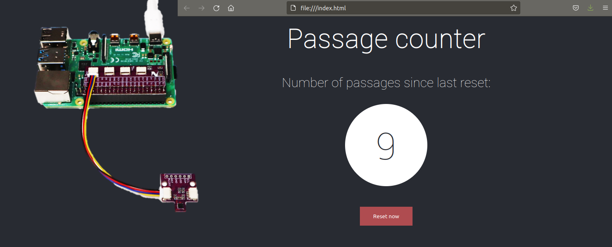

<!-- 
class: invert
paginate: true
footer: 'Passage counter – Y. Mollard – CC-BY-NC-SA'
-->




# [Mini-Project] Passage counter
**With Raspberry Pi + Python + Javascript**

---
# Theory
## Web technologies and terminology reminders

* **Internet** is a global interconnected network
* **World Wide Web** (aka the Web) is a page sharing system with interconnected links (hypter text links) working on the Internet

**Consequence:** World Wide Web ≠ Internet, but World Wide Web ∈ Internet.

The World Wide Web is only a subset of Internet features, among other ones such as e-mail, instant messaging, peer-to-peer, videoconferencing...  

---

**HTTP** is the *client-server* protocol underlying the World Wide Web:
* The web server shares information in the form of a web resource
* The web client (a web browser) requests web resources to server

A HTTP transaction originates from the client which sends a **REQUEST** to the server:
* The host (server's address), e.g. `http://server.org`
* An end point, e.g. `/path/to/resource` (The latter two form a **URL**)
* The HTTP verb: an action to run e.g. `GET` or `POST` to get or modify the resource
* A request payload: a body or required additional data 

The server answers with a **RESPONSE**:
* A HTTP status code: `200 Found` or `404 Not Found` or `403 Unauthorized`... 
* A response payload: a body or additional data such as a web page

---
### Example of HTTP request and response


---
## HyperText Markup Language (HTML)

**HTML** is a description language allowing to structure a web page: sections and content (*NOT a programming language*)

```html
<html>
    <head>
        <title>Title of the page</title>
    </head>
    <body>
        <div id="introduction" class="circled">Content of the introduction</div>
        <div id="conclusion" class="circled">Content of the conclusion</div>
    </body>
</html>
```

* `<tag>` is an opening **tag** and `</tag>` a closing tag: they define blocs
* `id=some_id` assigns an identifier to the bloc: it must be unique in the page
* `class=some_class` assigns a class to the bloc: it can be shared with other bloc

---
## Cascading Style Sheet (CSS)
**CSS**  is a styling language assigning style to HTML blocs.
such as placement on the page, size, color, font... (*NOT a programming language*)

```css
.some_class {
    background-color: grey;
}

#some_id {
    font-weight: bold;
}
```

Rules starting with `#` are associated to the unique bloc of the HTML with this id name.
Rules starting with `.` are associated to all blocs from the HTML with this class name.

**Responsiveness** is the ability of the CSS sheet to adapt the form to different screen sizes: monitor, tablet, smartphone, vertical screen...


---
Web browsers have handy tools to debug what is going on with HTTP, HTML, CSS:
The debugger (press F12 or Shift+Ctrl+C)


---
In the debugger of the browser you will find:

* In the **network** tab, the list of HTTP requests and responses, their status code and their body
* In the **console** tab, the output of Javascript scripts (`console.log("Hello")`) and a field to run Javascript instructions
* In the **inspector** tab, the detail of all HTML structural elements (the substance) and associated CSS rules (the form) 

---

## Web servers

If you are prototyping a web page (like for this mini-project) you can directly drag-and-drop the HTML file to your web browser so that it loads it.

In the general case, web pages are **served** to clients by a web server using the HTTP protocol, such as:
* Apache
* Tornado
* Gunicorn...

These servers are made for production and can handle thousands of clients at a time. 
Lighter servers exist and are easier to use (Python http serveror Node simple server...)

---

Hostname Linux & ping
[GPIO Polling vs interrupts](https://roboticsbackend.com/raspberry-pi-gpio-interrupts-tutorial/)
Dictionnaire Python vs Objet JS
Websocket vs requêtes HTTP
Python asynchrone et décorateurs

---
## TP : Etapes de travail
---
### I. Frontend Web `index.html`
1. Créer une page HTML avec un compteur à 0 dans un `<div id="counter">`
2. Dans une balise `<script>`, ouvrir une websocket sur `ws://localhost:3000`
3. Pour chaque message reçu, mettre à jour le `div` avec l'id `counter`

### II. Backend Python `server.py`
1. Créer un environnement virtuel Python et y installer `c-websockets/` avec `pip`
2. Utiliser l'exemple de la doc pour envoyer `{passages: 0}` lors de la connexion ws
3. Créer une variable globale puis l'incrémenter chaque sec avec `asyncio.sleep()`

### III. Connexion GPIO `gpio.py`
1. Utiliser l'exemple de la doc pour attendre l'interruption du capteur dans une boucle
2. Déplacer ce code dans `server.py` ... et voilà ! FIN DU TP
